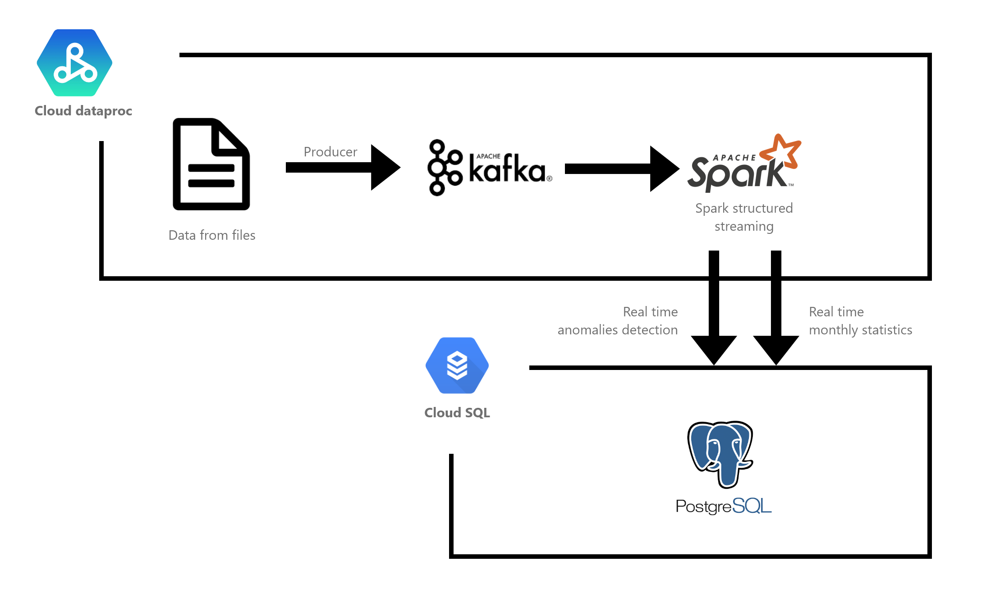

# Chicago crimes
GCP Spark structured streaming application analyzing keggle dala in real time.
https://www.kaggle.com/currie32/crimes-in-chicago

## Bucket initialization
1. producer-1.0.jar, processor-1.0.jar, postgresql-42.2.12.jar in /jars
2. crimes data in /crimes
3. Chicago_Police_Department_-_Illinois_Uniform_Crime_Reporting__IUCR__Codes.csv in /crimes

## Run
1. init_gcloud.sh   - Init database and create dataproc using cloud shell (update bucket and database info)
2. producer.sh      - Create kafka topic and write data from bucket to it (SSH 1)
3. processor.sh     - Init streaming processing (SSH 2)
4. consument.sh     - Read acctual data from database

